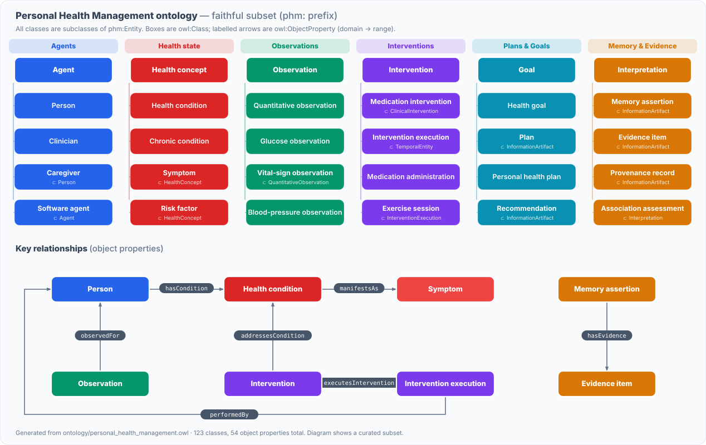

# Personal Health Agent 🩺

A lightweight, **local-first** personal health agent with **ontology-aligned
memory**. Log daily vitals or upload reports; the agent extracts structured
data, maps it to a healthcare ontology, stores it in append-only JSON, and
supports natural-language recall and on-demand reports with charts.

Built to the spec in `personal_health_agent_spec_architecture.md`, using the
**Personal Health Management Ontology** (`ontology/personal_health_management.owl`)
as the default ontology.

---

## Highlights

- **Chat logging** — “fasting glucose 156 mg/dL, BP 128/85, slept 6.5h” →
  three ontology-aligned observations, with unit normalization (e.g.
  `mmol/L → mg/dL`, `lb → kg`).
- **File ingestion** — PDF, CSV (long or wide form), image (OCR), and text.
  Duplicate uploads are detected by content hash.
- **Ontology-driven memory** — every record is validated against the OWL class
  hierarchy on write; synonyms (“sugar” → glucose) map to ontology classes;
  relationships are checked against property domain/range.
- **Natural-language recall** — “glucose trend last 7 days?” → time-filtered
  retrieval + average / min / max / trend / anomaly explanation.
- **Reports** — grouped by condition (diabetes, blood pressure, sleep …), with
  trends, anomalies, food-vs-glucose-style correlations, actionable insights,
  charts, and Markdown export.
- **Bring-your-own LLM.** Provider-agnostic: pick **OpenAI, Claude, or Gemini**
  (or **None**) in the sidebar and paste a key — nothing is hardcoded, so you
  can publish this to anyone. With no key it runs fully offline in
  deterministic, rule-based mode.
- **Ontology-first, always.** Vitals are stored in **SQLite**, but the OWL
  ontology is the authority: it governs what can be written, builds the LLM
  prompts, drives retrieval, and every answer carries a visible **ontology
  grounding trace** (classes, hierarchy paths, linked conditions, properties).

---

## The ontology at a glance

A faithful subset of the Personal Health Management ontology
([`ontology/personal_health_management.owl`](ontology/personal_health_management.owl))
— the class hierarchy grouped by branch, plus the key object properties that
tie observations, conditions, interventions and memory together. Every subclass
edge and property shown is verified against the OWL file at generation time.

<p align="center">
  
</p>

<sub>Regenerate after editing the ontology:
`python docs/generate_ontology_diagram.py`</sub>

---

## Quick start

```bash
pip install -r requirements.txt
streamlit run app.py
```

Then, in the app:

1. **Chat & Log** tab — type readings or questions.
2. **Upload** tab — drop a PDF/CSV/image (try `data/sample_labs.csv`).
3. **Report** tab — generate a structured report with charts.
4. **Memory** tab — inspect the ontology-aligned store and class hierarchy.

Run the end-to-end pipeline without the UI:

```bash
python -m tests.smoke_test
```

---

## Architecture

```
app.py                     Streamlit UI (chat, upload, report, memory tabs)
ontology/
  personal_health_management.owl   Default ontology (TTL)
  ontology_loader.py       Parse OWL → queryable class/property model; validation
  grounding.py             LLM prompt context + per-answer grounding trace
llm/
  base.py                  LLMProvider interface + LLMConfig (vendor-neutral)
  providers.py             OpenAI / Anthropic / Gemini / Null adapters
  factory.py               Provider selection, default models, env keys
  agent.py                 LLM understanding: intent, doc extraction, compose
ingestion/
  metrics.py               Metric registry: ontology class, units, synonyms, ranges
  extractor.py             Rule-based (regex) + optional LLM text → observations
  file_parser.py           PDF / CSV / image / text → observations (LLM-assisted)
memory/
  store.py                 SQLite store, ontology-governed writes, assertions
retrieval/
  retriever.py             NL query → metric/type/time filter; ontology-aware
  orchestrator.py          Plan-then-act: LLM plan → deterministic execution
  query.py                 Retrieval + reasoning + grounding → explained answer
reports/
  reasoning.py             Aggregates, trends, anomalies, correlations
  generator.py             Structured report + Markdown + chart dataframes
data/                      Local memory (health.db SQLite)
tests/smoke_test.py        Full-pipeline check (no Streamlit)
```

### How the LLM is used (actively, end-to-end)

When a provider is selected, the LLM drives the whole turn — not just a final
summary. `llm/agent.py` + `retrieval/orchestrator.py` implement a plan-then-act
loop where **the model decides intent and structure, but all numbers are
computed in code** so nothing is hallucinated:

| Stage | What the LLM does |
|-------|-------------------|
| **Understand chat** | Classifies the turn (log / query / mixed), pulls metric-value-unit-time, and extracts memory facts (conditions, medications) — as ontology-typed JSON. |
| **Update memory** | Those facts become ontology `entities` + `MemoryAssertion`s (e.g. `self hasCondition "Diabetes mellitus"`), beyond just numeric vitals. |
| **Parse files** | Reads PDF/report text and extracts measurements the regex layer misses (e.g. HbA1c from a lab PDF), merged with rule-based extraction. |
| **Understand queries** | Interprets which metrics, time window, and analysis (trend / average / anomaly / correlation) the question needs. |
| **Respond with memory** | Composes the answer from the *retrieved, already-computed* facts, in ontology language, with association (not causal) wording. |
| **Design charts** | Chooses chart type (line / bar / scatter) and which metrics to plot; code renders it. |

Every stage has a deterministic fallback, so with **None**/no key the app still
runs (rule-based router, regex extraction, fixed line charts). Verify the LLM
path with no API calls:

```bash
python -m tests.test_llm_agent   # uses a scripted MockProvider
```

### LLM layer (bring your own provider)

Everything depends only on the `LLMProvider` interface in `llm/base.py`, so no
vendor is baked in:

| Provider | SDK (`pip install …`)      | Key env var(s)                    |
|----------|----------------------------|-----------------------------------|
| OpenAI   | `openai`                   | `OPENAI_API_KEY`                  |
| Claude   | `anthropic`                | `ANTHROPIC_API_KEY`, `CLAUDE_API_KEY` |
| Gemini   | `google-generativeai`      | `GEMINI_API_KEY`, `GOOGLE_API_KEY` |
| None     | —                          | — (deterministic rule-based)      |

Pick the provider, model, and key in the sidebar at runtime, or preset one via
env vars. Keys live in the Streamlit session only and are never written to
disk. Any provider failure falls back to the rule-based path, so answers are
never worse than deterministic.

### Data flow

```
User input / file → Ingestion → Extraction → Ontology mapping → Memory store
Query → Query parser → Ontology mapping → Retriever → Reasoning → Report
```

### Memory layout — SQLite (`data/health.db`)

| Table               | Contents                                             |
|---------------------|------------------------------------------------------|
| `observations`      | Vitals log; indexed by class/metric/person/time; `supersedes` gives versioning |
| `entities`          | People, medications, conditions (deduplicated)       |
| `relationships`     | Ontology-validated links (e.g. medication→condition) |
| `memory_assertions` | `phm:MemoryAssertion`: subject/predicate/object + status + evidence |
| `uploads`           | Upload content hashes for duplicate detection        |

SQLite gives fast filtering/aggregation for vitals, while the ontology remains
the semantic authority (see below). Each observation carries provenance
(`source`, `recorded_at`), a `timestamp`, its ontology `class`, and a
`supersedes` field for versioning — matching the ontology's separation of
observations from interpretations.

---

## Ontology usage — central to every turn

The whole point of the app is to show the ontology doing real work, not sitting
on the side. `rdflib` loads the OWL file and the ontology drives **five** things:

1. **Governs writes** — an observation's class must be an `Observation`/`Entity`
   subclass or SQLite never receives it (rejected with a reason). The DB stores
   data; the ontology decides what is *valid* data.
2. **Builds the LLM prompts** — `ontology/grounding.build_llm_context()`
   generates the system prompt live from the class hierarchy and object
   properties, so extraction and answers are expressed in ontology terms
   (`GlucoseObservation ⊂ QuantitativeObservation ⊂ Observation`).
3. **Grounds every answer** — each response carries a **grounding trace**
   (`ground(...)`): the classes used, their hierarchy paths, linked chronic
   conditions (e.g. glucose → *Diabetes mellitus* via `manifestsAs`), and the
   relationships in play (`observedFor`, `hasCondition`, `addressesCondition`).
   The UI shows it under every reply.
4. **Drives retrieval** — querying a parent class (“vital signs”) expands to all
   descendant classes via the ontology tree; synonyms (“sugar”) map to classes.
5. **Types memory** — condition links are stored as `phm:MemoryAssertion`s with
   status (`Candidate`/`Accepted`/…) and evidence, honouring the ontology's
   provenance model.

To use a **different ontology**, replace the file in `ontology/` and point
`DEFAULT_ONTOLOGY_PATH` (or pass a path to `load_ontology`) at it; extend
`ingestion/metrics.py` to map new metrics to the new classes, and the
condition-link maps in `ontology/grounding.py` if desired.

---

## Adding a new metric

Add an entry to `REGISTRY` in `ingestion/metrics.py` with its ontology class,
canonical unit, synonyms, unit aliases and normal range. It is then
automatically available to extraction, retrieval, reasoning and reports.

---

## Optional dependencies

- **PDF**: `pdfplumber`
- **Image OCR**: `pytesseract` + `Pillow` (and a `tesseract` binary)
- **LLM assist**: `anthropic` + `ANTHROPIC_API_KEY`

If an optional dependency is missing, the corresponding feature reports a clear
message and the rest of the app keeps working.

---

## Design principles

Local-first and simple · ontology as the semantic authority (not just
structure) · SQLite for fast vitals storage, ontology for meaning ·
provider-agnostic LLM for extraction/summary, not storage · optimized for
recall speed and explainability.

---

## Disclaimer

This project is for personal tracking and educational purposes only. It is
**not a medical device** and does not provide medical advice, diagnosis, or
treatment. Always consult a qualified healthcare professional about your health.

## License

Released under the [MIT License](LICENSE).
